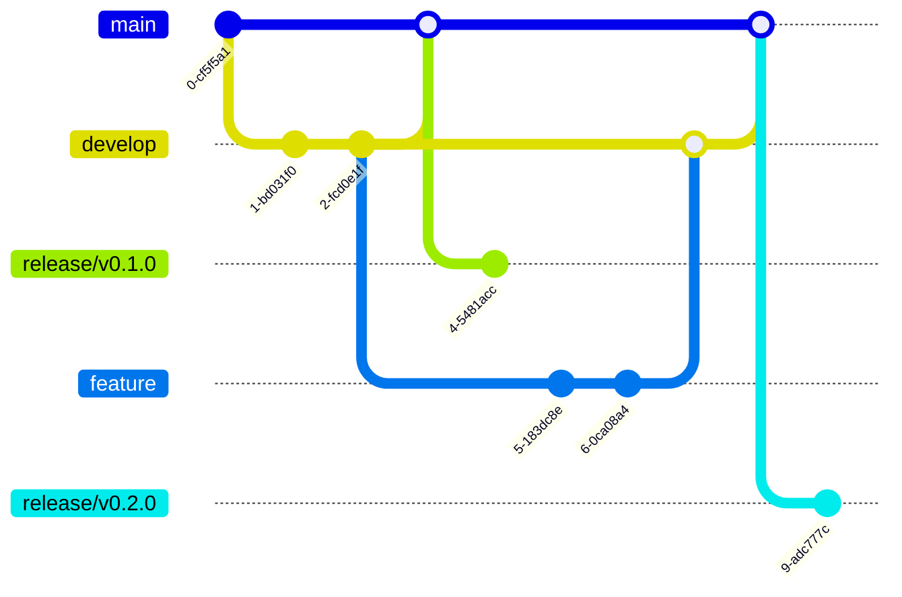
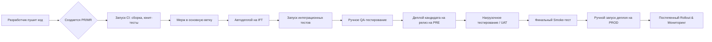
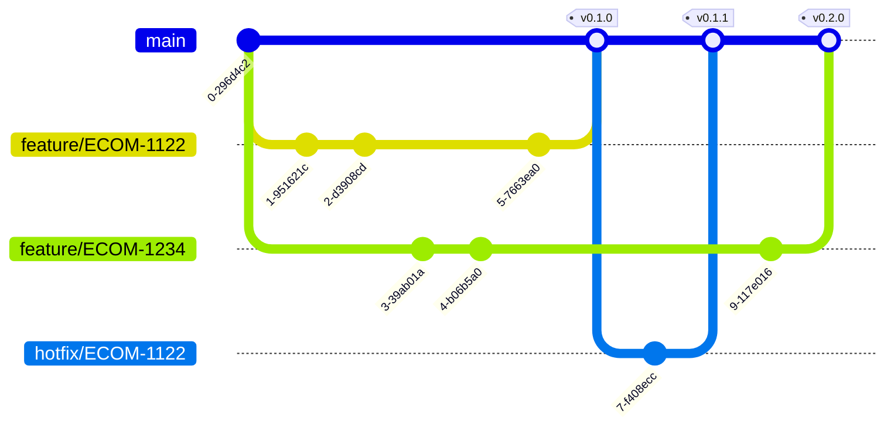

## Процессы работы в командах
### GitFlow

*GitFlow* — это определенная надстройка над моделью ветвления системы контроля версий *Git*, которая включает в себя использование фича веток и несколько основных веток. По сравнению с разработкой на основе «магистрали», *GitFlow* имеет многочисленные, более долгоживущие ветки и более крупные фиксации. Представляет собой строго регламентированную модель с фиксированными типами веток и четкими правилами их слияния. Идеальна для проектов с четким циклом выпуска версий (_release-based_), особенно если требуется параллельная поддержка нескольких версий продукта (например, v1.2, v2.0).
**Ключевые ветки:**
- `main`/`master`: Отражает состояние _production_-окружения. Каждый коммит с тегом — это новая версия.
- `develop / development`: Основная ветка для интеграции новых функций. Отражает состояние, готовящееся к следующему релизу.
- `feature/*`: Ветки, ответвляющиеся от `develop` для разработки новой функциональности. После завершения мержатся обратно в `develop`.
- `release/*`: Ветка, ответвляющаяся от `develop` когда она готова к релизу. Здесь происходит только фиксинг багов, доработка документации и другие релизные активности. После готовности мержится в `main` и в `develop` (чтобы учесть все правки).
- `hotfix/*`: Ветки, ответвляющиеся от `main` для срочного исправления бага в продакшене. Мержатся обратно в `main` и в `develop`.

**Плюсы:**
- **Четкость и порядок:** Все знают, куда и что мержить. Процесс предсказуем.
- **Стабильность `main`:** Ветка `main` всегда содержит только проверенные релизы, что критично для enterprise-решений.
- **Параллельная разработка:** Позволяет легко вести разработку новых функций (`develop`) одновременно с подготовкой текущего релиза (`release/*`) и экстренными правками (`hotfix/*`).
**Минусы:**
- **Сложность:** Большое количество долгоживущих веток. Постоянное поддержание актуальности `develop` и разрешение конфликтов может быть рутиной.
- **Низкая частота релизов:** Процесс выпуска новой версии (`release/*` ветка) часто занимает время, что противоречит идеологии непрерывной поставки (*Continuous Delivery*).
- **Низкая скорость обратной связи:** Функция считается "готовой" только когда попадает в долгоживущую ветку `develop`, а не в основную ветку.
Описание работы по *GitFlow* описано в 2010 году Винсентом Дриссеном в [статье](https://nvie.com/posts/a-successful-git-branching-model/).

_CI_/_CD_ _Pipeline_ для _GitFlow_ представлен на рисунке ниже.

### Trunk based development
*TBD* - представляет собой облегченную методологию, где разработчики постоянно мержат небольшие инкрементальные изменения в одну главную ветку (`main`/`master`). Ключевые принципы — короткоживущие *feature*-ветки (не более 1-2 дней) и прямые коммиты в `main`.
**Ключевые принципы:**
- **Одна главная ветка (`main/master`):** Содержит всегда работоспособный код, готовый к развертыванию в production окружении.
- **Короткоживущие *feature*-ветки:** Ветки создаются для разработки одной небольшой задачи и немедленно удаляются после мержа в `main`.
- **Частые мержи:** Разработчики синхронизируются с `main/master` multiple times a day (путем rebase или merge), чтобы минимизировать расхождение кода и конфликты.
- **Необходимость мощного CI/CD:** Обязательно требуется автоматизированный пайплайн, который для каждого коммита в `main` запускает полный набор тестов (*unit, integration, e2e*) и разворачивает сборку на staging-окружение. Без этого подход сложен в реализации.

**Плюсы:**
- **Скорость и частота поставки:** Позволяет осуществлять деплой в *production multiple times a day* (*Continuous Deployment*).
- **Минимум конфликтов:** Короткоживущие ветки и частые синхронизации с `main` *drastically reduce merge hell*.
- **Непрерывная интеграция:** Проблемы интеграции выявляются сразу, а не в конце спринта или релиза.
- **Подходит для *DevOps*-культуры:** Идеально ложится на практики *CI/CD* и автоматизации.
**Минусы:**
- **Высокие требования к дисциплине:** Требует высокой квалификации команды в написании тестируемого кода.
- **Зависимость от инфраструктуры:** Без мощного и быстрого *CI/CD* пайплайна подход рискует стать неуправляемым.
- **Сложность для больших монолитов:** Может быть сложно внедрить в legacy-проектах с плохим покрытием тестами.

 **Ключевые элементы успеха при TBD**
1. **Культура ответственности:** Разработчики не просто "закидывают код в main", они несут ответственность за его работу в проде.
2. **Feature Flags (Флаги функций):** Позволяют мержать недоделанные функции в `main`, но держать их выключенными для пользователей. Включаются они позже, когда все готово. Это основа для декомпозиции больших задач.
3. **Мощный и быстрый CI/CD:** Если тесты идут 4 часа, то частые мержи теряют смысл. Необходимо оптимизировать пайплайн для скорости.
4. **Инвестиции в тесты:** Без надежной автоматической тестовой базы TBD превращается в хаос. Тесты — это ваша страховка.
5. **Превентивный мониторинг:** Вы должны знать о проблеме раньше, чем ваши пользователи.

_CI_/_CI_ _Pipeline_ для _TDB_ представлен на рисунке ниже.

### Сравнение методологий TBD vs GitFlow

| Критерий                | Git Flow                                                | Trunk-Based Development                           |
| ----------------------- | ------------------------------------------------------- | ------------------------------------------------- |
| Сложность               | Высокая                                                 | Низкая (в реализации), Высокая (в дисциплине)     |
| Частота релизов         | Низкая/Средняя (релиз-*based*)                          | Очень высокая (несколько в день)                  |
| Поддержка *CI/CD*       | Возможна, но не идеальна                                | **Обязательна и является краеугольным камнем**    |
| Стабильность main       | Очень высокая                                           | Высокая (обеспечивается CI/CD)                    |
| Параллельная разработка | Отличная поддержка                                      | Хорошая                                           |
| Накладные расходы       | Высокие (управление ветками)                            | Низкие                                            |
| Идеальные проекты       | Продукты с версиями, desktop/mobile ПО, enterprise-софт | Веб-сервисы, стартапы, микросервисные архитектуры |

Выбор методологии по работе с системой контроля версий существенно влияет на реализацию _CI_/_CD_ пайплайна.
## Git стратегия и окружения

Традиционно существует 4 окружения:
- DEV
- IFT
- PRE (Stage)
- PROD
### Dev (Development / Среда разработки)
Это окружение для разработчиков. Основная цель — создание нового кода, фикса багов и первичное тестирование отдельных функций в изоляции.
Используется и и иногда тестировщики на ранних этапах.
**Что там происходит:**
- Пишется и компилируется новый код.
- Проводятся быстрые unit-тесты (модульные тесты).
- Отлаживается логика отдельного компонента или микросервиса.
- Данные обычно "мусорные" (fake, mock) или на крайний случай — копия небольшой части реальных данных.    
**Ключевые характеристики:** Максимально нестабильное, часто обновляется (по несколько раз в день), минимальные требования к инфраструктуре (может быть локальным на машине разработчика или в виде контейнера).
### IFT (Integration & Functional Testing / Интеграционное и Функциональное тестирование)
**Для чего необходимо:** Это первая среда, где код от _всех_ разработчиков собирается вместе. Главная цель — убедиться, что новые фичи и исправления корректно взаимодействуют друг с другом и не ломают существующую функциональность.
Используется QA-инженерами (тестировщики), автоматизаторами, иногда используют продакты для демонстрации фич.
**Что там происходит:**
- **Интеграционное тестирование:** Проверяется взаимодействие между модулями, сервисами и базами данных.
- **Функциональное тестирование:** Проверяется соответствие функционала техническому заданию (ТЗ).
- Запускается набор автоматизированных регрессионных тестов.
- Выполняется первичное тестирование производительности и нагрузки.
**Ключевые характеристики:** Более стабильное, чем *Dev*. Обновляется по мере готовности функциональности (например, по завершении задачи в *Jira*). Данные близки к реальным, но все еще анонимизированы или сгенерированы.
### Pre (Pre-Production / Staging / Предпродакшен)
Pre (Stage) окружение представляет собой **полную и точную копия *Prod*-окружения**. Его главная и единственная цель — финальная проверка всего: кода, конфигураций, скриптов развертывания и процедур перед выкаткой на реальных пользователей. Здесь ищут не баги в логике (это делалось на IFT), а любые расхождения с продакшеном.
Используется *DevOps*-инженерами, *QA*, ведущие разработчики.
**Что там происходит:**
- **Тестирование выпуска (Release Testing):** Отрабатывается весь процесс деплоя, как на боевом сервере.
- **Дымовое тестирование (Smoke Testing):** Быстрая проверка, что система после обновления "заводится".
- **Тестирование отката (Rollback Testing):** Проверяется, что в случае неудачи можно быстро и безопасно откатиться на предыдущую версию.
- **Тестирование на соответствие безопасности (Security Hardening).**
**Ключевые характеристики:** Максимально стабильное. Обновляется только проверенными и протестированными на IFT сборками. Конфигурация, версии ОС, СУБД, кэшей и т.д. — **идентичны Prod**. Данные — максимально приближены к реальным, но всегда обезличены. 
### Prod (Production / Продакшен, боевое окружение)
Это среда, где работают реальные пользователи и происходят реальные бизнес-процессы. Цель — обеспечить стабильную, безопасную и высокопроизводительную работу сервиса.
Служит для конечных пользователей, клиентов.
    
**Что там происходит:**
- Работает бизнес.
- Принимаются платежи, обрабатываются заказы, публикуется контент.
- Мониторятся метрики производительности, ошибок и бизнес-показателей.
- В идеале — применяются схемы плавного и бесшовного развертывания (синие-зеленые деплои, canary-релизы).

**Ключевые характеристики:** Абсолютная стабильность и безопасность. Изменения вносятся строго по регламенту, через проверенные процедуры, отработанные на **Pre-окружении**. Все данные — настоящие и критически важные.
### Сводная таблица

| Окружение | Цель                                               | Кто использует     | Стабильность | Данные                   |
| --------- | -------------------------------------------------- | ------------------ | ------------ | ------------------------ |
| **Dev**   | Разработка и первичное тестирование                | Разработчики       | Низкая       | Fake / Mock              |
| **IFT**   | Интеграция и функциональное тестирование           | QA, Автоматизаторы | Средняя      | Обезличенные             |
| **Pre**   | Финальная репетиция релиза, тестирование окружения | DevOps, QA         | Высокая      | Обезличенные, как в Prod |
| **Prod**  | Работа с реальными пользователями                  | Пользователи       | Максимальная | Реальные, продакшен      |

## CI/CD
Процесс доставки исходного кода на окружения состоит из стадий (stage), которые в свою очередь могут состоять из этапов.
### Стадия линтинга

Стадия **линтеров** в CI/CD – это первый барьер качества кода.  
Она запускается **ещё до тестов и сборки**, потому что быстрее всего отлавливает очевидные проблемы.
Для чего нужны линтеры
1. **Единый стиль кода**
    - Автоматически проверяют форматирование, отступы, кавычки, длину строк (etc).
    - Исключают «вкусовщину» в команде – все пишут одинаково.
2. **Предотвращение ошибок ещё до запуска программы**
    - Подсвечивают неиспользуемые переменные, забытые импорты, некорректный синтаксис.
    - Для Python (flake8, mypy) – типовые ошибки или несовпадение типов.
    - Для Dockerfile (hadolint) – неправильные инструкции, устаревшие практики.
    - Для YAML (yamllint) – ошибки форматирования, которые могут «сломать» деплой.
3. **Снижение затрат на ревью**
    - Ревьюеры обсуждают архитектуру и логику, а не пробелы и кавычки.
    - В PR остаётся только содержательная дискуссия.
4. **Ускорение пайплайна**
    - Линтеры работают за секунды.
    - Если код не проходит линтеры, дальше не запускаются тесты/сборки → экономия ресурсов CI.
**Cтадия линтеров** – это «санитар» кода. Она быстро и дёшево гарантирует, что дальше в пайплайн попадёт только чистый, читабельный и технически корректный код.
### Стадия тестирования

Тесты в CI/CD проверяют **функциональность кода**, то есть то, что программа делает именно то, что задумано.
Обычно тесты делятся на уровни:
1. **Unit-тесты** – проверяют отдельные функции/методы.
    - Быстрые, изолированные, дают понять, что базовая логика работает.
2. **Интеграционные тесты** – проверяют взаимодействие компонентов: БД, API, очереди.
    - Гарантируют, что модули «дружат» друг с другом.
3. **E2E (end-to-end) тесты** – эмулируют сценарии пользователя (например, вход в систему, оформление заказа).
    - Проверяют продукт целиком, как он будет вести себя «вживую».
4. **Регрессионные тесты** – проверяют, что новые изменения не сломали старый функционал.

Почему тесты идут **после линтеров**:
1. **Быстрее отловить очевидные ошибки**
    - Линтеры работают за секунды и не требуют запуска среды.
    - Если код даже не соответствует базовым правилам (синтаксис, формат, опечатки), нет смысла гонять «тяжёлые» тесты.
2. **Экономия ресурсов CI**
    - Тесты могут занимать минуты, иногда десятки минут.
    - Зачем тратить их, если уже на линтинге видно, что код не пройдёт?
3. **Чистый вход в тесты**
    - Тесты запускаются только на коде, который гарантированно читаем, структурирован и компилируется.
    - Это уменьшает «шум» от ошибок (тесты падают не из-за пробела, а из-за логики).
4. **Лучшее разделение ответственности**
    - Линтер = статический анализ.
    - Тесты = динамическая проверка поведения.
    - Такой порядок даёт понятный pipeline: сначала чистим код, потом проверяем его работу.
**Важность стадии тестов**
- Уверенность, что новая логика работает как нужно.
- Защита от багов, которые могут «утечь» на stage/preprod/prod.
- Повышение стабильности продукта: каждый коммит проходит через фильтр качества.
- Возможность смело рефакторить – тесты страхуют от поломок.
### Quality Gates
_Quality Gate_ — это **набор правил и метрик**, которые код должен пройти, прежде чем пойти дальше по *CI*/*CD*. 

Примеры метрик:
- **Coverage** (покрытие кода тестами, например ≥ 80%).
- **Нет критических багов/уязвимостей** (по SonarQube/Trivy/Snyk).
- **Нет code smells** или технического долга выше порога.
- **Нет утечек секретов** (ключи, токены).

Почему _quality gates_ идут **после тестов**
1. **Основаны на результатах тестов**
    - Чтобы оценить покрытие кода тестами, сначала нужно их прогнать.
    - Чтобы проверить регрессию (не сломалось ли что-то), нужны результаты запуска.
2. **Фильтр на “качество, а не только работоспособность”**
    - Тесты говорят: _“код работает”_.
    - Quality gates добавляют: _“код работает **и** соответствует нашим стандартам качества”_.
3. **Экономия времени и ресурсов**
    - Если тесты упали, уже нет смысла считать coverage или смотреть SonarQube.
    - Сначала убеждаемся, что система вообще “жива”, а потом проверяем её качество.
4. **Снижение технического долга**
    - Если запускать quality gates без тестов, то будет неполная картина.
    - Например, код может пройти статический анализ, но при этом не иметь покрытия тестами.
### Build
Стадия ***build*** — это шаг пайплайна, где из исходников получается артефакт, который можно запускать и деплоить.
Зачем нужна стадия *build*:
1. **Единый артефакт для всех окружений**
    - Собираем один и тот же Docker-образ/бинарь/пакет.
    - Дальше его выкатываем на stage → preprod → prod без пересборки.
    - Это исключает баги “у меня локально работает”.
2. **Детерминированность**
    - Артефакт привязан к git commit или версии (SemVer).
    - Можно откатиться, повторно задеплоить ту же версию, воспроизвести баг.
3. **Оптимизация и упаковка**
    - Компиляция (Go, Java, TypeScript → JS).
    - Сборка Docker-образа (multi-stage: билд → рантайм).
